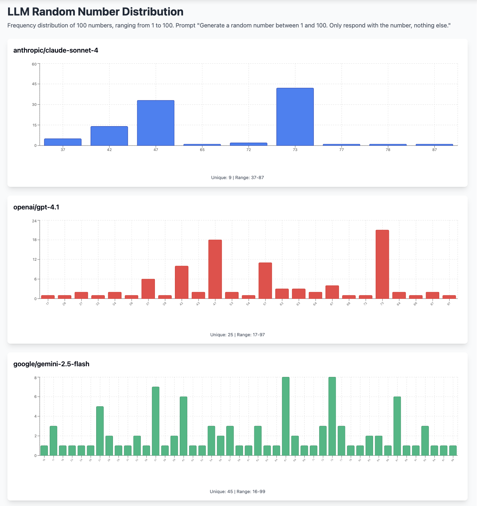

# MCP Random Number

An MCP (Model Context Protocol) server that provides true random numbers from atmospheric noise via random.org.

## Why?

LLMs struggle with generating truly random numbers. This chart shows the distribution bias of 100 random numbers (range 1-100) from 3 popular LLMs:



## Installation

1. **Copy, Install, Build:**
   ```bash
   git clone https://github.com/maxbogo/mcp-random-number.git
   cd mcp-random-number
   npm install
   npm run build
   ```

2. **Connect to the MCP server:**

   Add the below json to your configuration with the appropriate `/ABSOLUTE/PATH/TO/` value:
   ```json
   {
     "mcpServers": {
       "mcp-random-number": {
         "command": "node",
         "args": ["/ABSOLUTE/PATH/TO/mcp-random-number/build/index.js"]
       }
     }
   }
   ```

